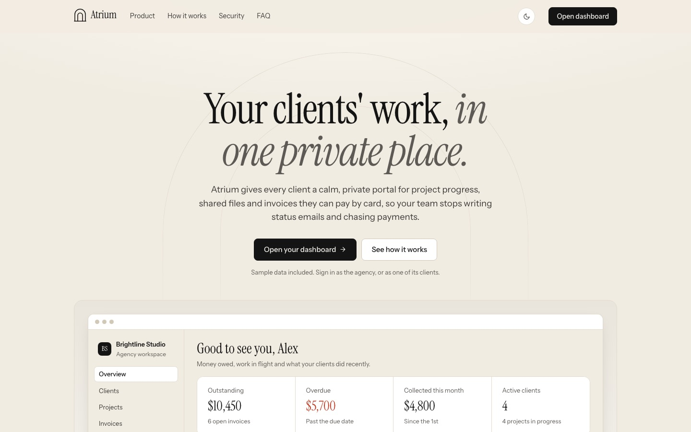
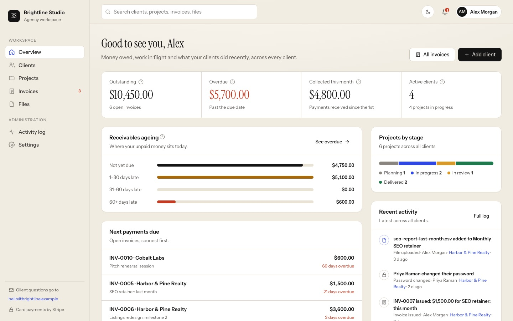
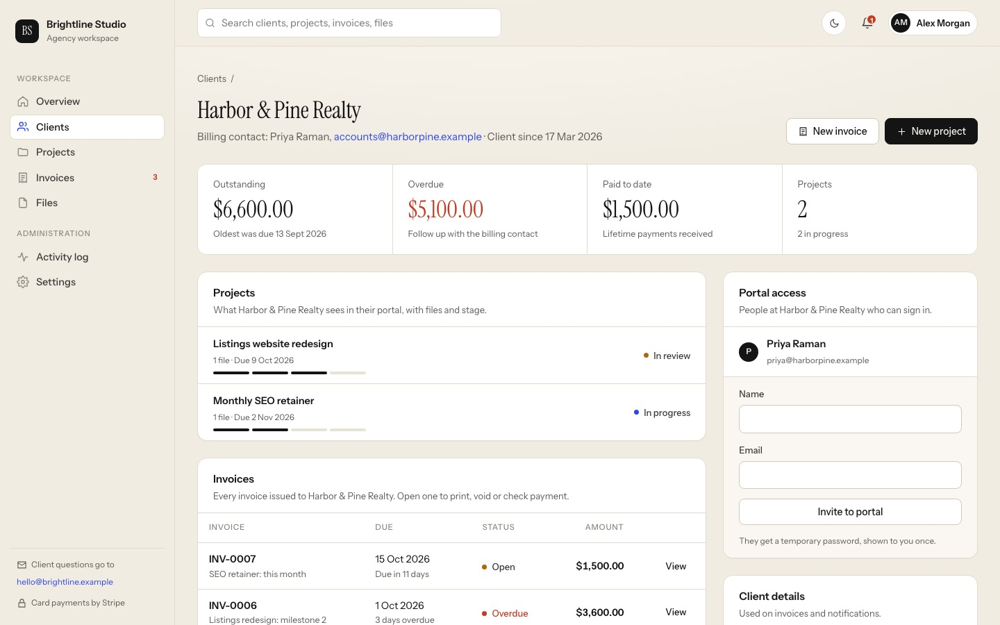
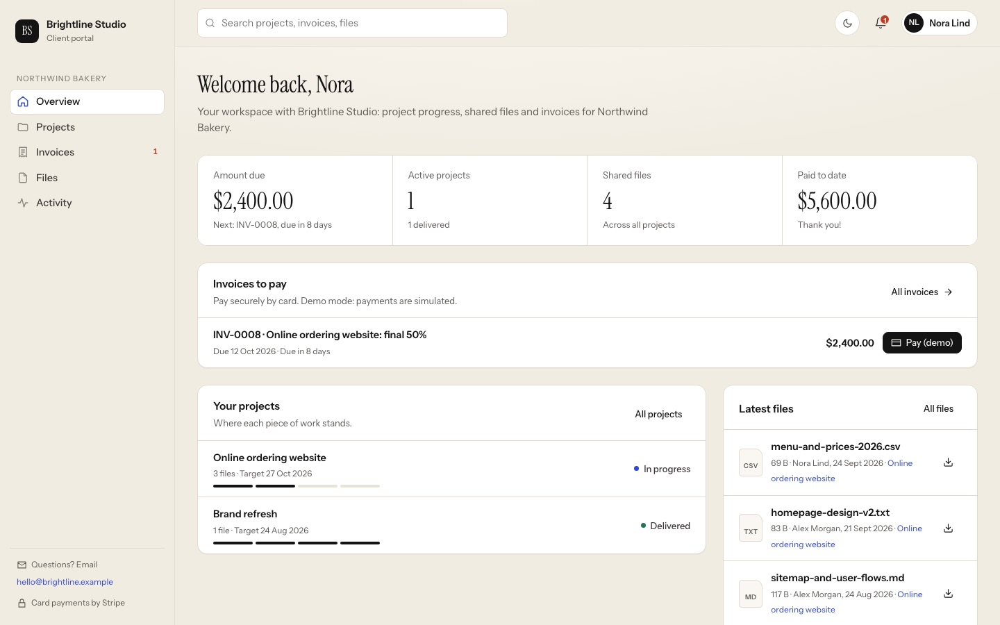
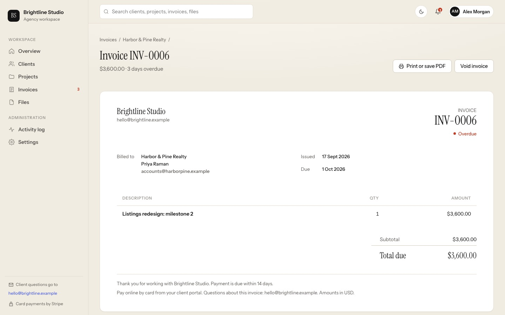
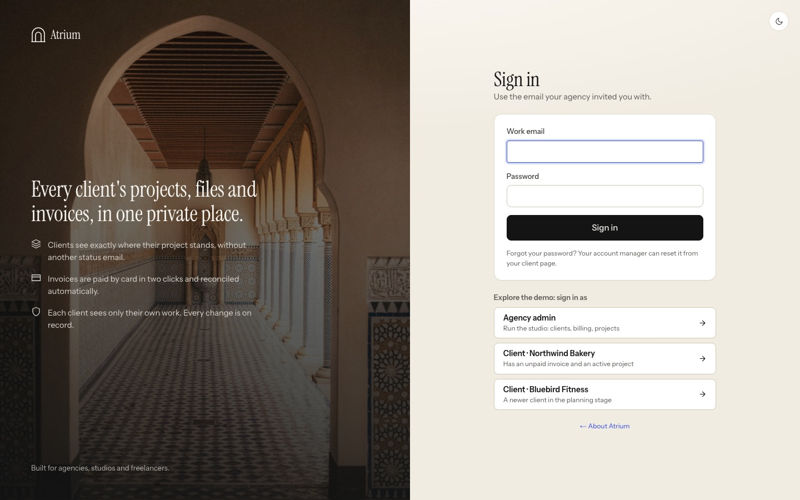

# Atrium: the client portal for agencies and studios

Atrium gives every client of an agency, studio or freelancer one private place to follow project progress, swap files
and pay invoices by card. The agency gets a dashboard showing who owes what, what's late and what each client did
recently.



**Built by [Sydney Torkornoo](https://baobabpeaks.com)**, full-stack developer · [GitHub](https://github.com/sydneyKojo)

**Live demo: [atrium.baobabpeaks.com](https://atrium.baobabpeaks.com)**. Sign in with one click as the agency or as a client.

---

## The problem it solves

Small agencies run client work over email: "any update on the site?", final files lost in long threads, PDF invoices
chased by hand, and no record of who approved what. Atrium replaces that with one portal per client:

- Clients **check the project stage themselves**, any time, instead of emailing for updates.
- **Files live with the project** they belong to, downloadable in one click.
- **Invoices are paid by card** (Stripe Checkout) and marked paid automatically.
- **Every change is logged**, so "when was this sent?" has an answer.

**Who it's for:** design and web studios, marketing agencies, consultancies and freelancers with roughly 5–50 active
clients, and those clients' teams.

## Screenshots

| Agency overview | A client's page (agency view) |
|---|---|
|  |  |
| **What the client sees** | **Printable invoice** |
|  |  |



## Features

### For the agency (admin)
- **Overview:** outstanding, overdue and collected-this-month totals; an ageing chart of unpaid invoices by how late
  they are; projects by stage; payments due next; a live activity feed. Every figure has a plain-language definition.
- **Clients:** search, outstanding and overdue amounts per client, portal users, add and edit clients, invite people
  (a one-time password shown once, never placed in a URL).
- **Projects:** filter by stage; move work through *Planning → In progress → In review → Delivered* (the client is
  notified of each change).
- **Invoices:** issue with the workspace's default payment terms, filter by status (not yet due, overdue, paid,
  voided), void with a confirmation step, print or save as PDF, export to CSV.
- **Files, activity log** (filterable audit trail with CSV export), **settings** (business name, support email,
  payment terms, invoice note, Stripe connection status), **global search**, **notifications**.

### For the client
- **Overview:** amount due with one-click card payment, project progress bars, latest files, recent updates.
- **Projects:** stage, target date, deliverables; upload briefs and assets back to the agency (the agency is notified).
- **Invoices:** pay by card, view and print each invoice, CSV export. **Files**, **activity**, **account & password**.

### Product details
- Public homepage explaining the product, sign-in page with one-click demo accounts, 404, loading and error states.
- Light mode by default with a remembered dark mode (soft "e-ink" greys, not black).
- Works on desktop, tablet and phone (the sidebar becomes a slide-out menu).

## How it works

```
Browser ──► Next.js 16 (App Router)
              ├─ Server Components render every page with fresh data (no client-side data fetching)
              ├─ Server Actions handle forms: create client/project/invoice, invite user, settings, password
              ├─ Route handlers: file upload/download, card payment, Stripe webhook, CSV exports
              └─ Drizzle ORM ──► PostgreSQL (clients, users, sessions, projects, files, invoices, activity, workspace)
Stripe Checkout ──► signed webhook ──► invoice marked paid + activity recorded
```

## Security decisions

- **One access rule** (`canAccessClient`): admins see every client; a client user sees only their own company. Every
  page, download, upload, payment and export goes through it. Anything else returns *not found*, so ids can't be probed.
- **Passwords** hashed with scrypt. **Sessions** are random 256-bit tokens stored only as SHA-256 hashes, in httpOnly
  SameSite cookies. Changing a password signs out every other device. Unknown emails take as long to reject as wrong
  passwords.
- **Payments** are confirmed only by Stripe's signature-checked webhook, never by the browser redirect, and marking
  paid is idempotent (Stripe may retry).
- **Uploads** are stored under random ids, limited to 20 MB, and always served as downloads with `nosniff`, so an
  uploaded HTML file can't run inside the portal.
- **CSV exports** neutralise spreadsheet formulas (`=`, `+`, `-`, `@`) while leaving phone numbers intact.

## Tech stack

Next.js 16 (App Router, Server Components, Server Actions) · React 19 · TypeScript · PostgreSQL · Drizzle ORM ·
Stripe Checkout and webhooks · Zod · Vitest · hand-written CSS design system (Instrument Serif and Instrument Sans,
light and dark themes, no UI framework).

## Run it locally

Requires Node 22+ and PostgreSQL.

```bash
npm install
cp .env.example .env          # works as-is in demo mode
createdb client_portal && createdb client_portal_test
npm run seed                  # demo agency "Brightline Studio" with 4 clients, projects, invoices, files and history
npm run dev                   # http://localhost:3400
npm test                      # 17 tests: auth, sessions, access rules, invoices, Stripe webhooks, activity, CSV
npm run build                 # production build (also type-checks)
```

Demo accounts (one click on the sign-in page while `DEMO_MODE=true`): `admin@demo.test`, `client@demo.test`,
`client2@demo.test`, password `demo-password`.

**Payments:** without Stripe keys the portal runs in demo mode ("Pay (demo)" marks the invoice paid). Add
`STRIPE_SECRET_KEY` and `STRIPE_WEBHOOK_SECRET` to take real test payments:
`stripe listen --forward-to localhost:3400/api/stripe/webhook`.

## Project structure

```
src/app/            pages: homepage, login, (app)/admin/*, (app)/portal/*, invoices, projects, search, account
src/app/api/        uploads, downloads, payments, Stripe webhook, CSV exports
src/components/     design-system components, icons, client-side helpers (theme toggle, dialogs)
src/lib/            auth, billing, activity log, queries, files, CSV
src/db/schema.ts    tables and idempotent DDL
scripts/seed.ts     realistic demo data relative to today's date
tests/              Vitest suite against a real Postgres test database
```

## Deployment notes

Runs as a single Node service with a PostgreSQL database (Railway, Render or Fly.io). For serverless hosting such as
Vercel, move file storage in `src/lib/files.ts` to S3, Cloudflare R2 or Vercel Blob. Turn `DEMO_MODE` off for real use.

---

Demo companies and people are fictional. Photos on [Unsplash](https://unsplash.com) by Victoriano Izquierdo, Luca
Severin and Vitaly Gariev.

© 2026 Sydney Torkornoo. All rights reserved. This code is published for portfolio review; it is not licensed for
reuse. For work enquiries, visit [baobabpeaks.com](https://baobabpeaks.com).
